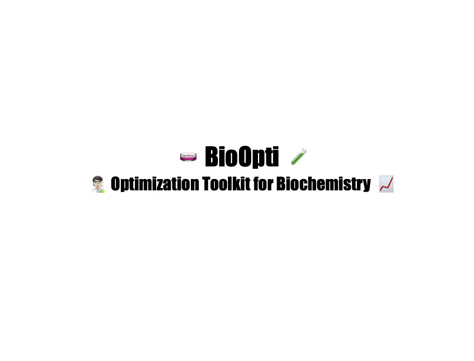

  


<h1 align="center">BioOpti 🧪</h1>

<br>

**BioOpti** was created to help optimizing biochemical workflows, from culture media formulation to enzymatic reaction simulations.  
Designed for researchers, students, and bioprocess enthusiasts, BioOpti makes it simple to model, predict, and refine experimental setups.

---

## 📚 Table of Contents

- [✨ Features](#-features)
- [🚀 Installation](#-installation)
- [🛠 Development Setup](#%-development-setup)
- [✅ Running Tests](#-running-tests)
- [⚡ Quick Start](#-quick-start)
- [🤝 Contributors](#-contributors)
- [⚖️ License](#-license)

---

## ✨ Features

- 📈 **Culture Media Optimization** *(Coming soon)*:  
  Calculate optimal nutrient ratios to maximize organism growth or product yield.

- 🔬 **Enzymatic Reaction Simulation**:  
  Predict enzyme-catalyzed reaction rates under varying conditions (substrate concentration, pH, temperature, inhibitors).
  Easily simulate reactions based on Vmax, Km, inhibition type, and environmental factors.

---

## 🚀 Installation

First, create a new environment (feel free to use a different environment name if you prefer):

```bash
conda create -n bioopti python=3.10
conda activate bioopti
pip install .
```

If you need JupyterLab for interactive notebooks:

```bash
pip install jupyterlab
```
---

## 🛠️ Development Setup

If you're setting up development from scratch, initialize Git and push to your GitHub repository (`https://github.com/Clarabrgnz/BioOpti`):

```bash
git init
git add *
git add .
git commit -m "Initial commit"
git branch -M main
git remote add origin git@github.com:Clarabrgnz/BioOpti.git
git push -u origin main
```

For local development (install with testing and documentation dependencies):


```bash
pip install -e ".[test,doc]"
```

---

## ✅ Running Tests

To run the test suite and check coverage:

```bash
pip install tox
tox
```

---

## ⚡ Quick Start

### ➞ Culture Media Optimization
*(Coming soon! 🚧)*

### ➞ Simulating Enzymatic Reactions
This example shows how to simulate the rate of an enzyme-catalyzed reaction using known kinetic parameters.
Provide experimental conditions such as substrate concentration, Vmax, Km, pH, temperature, and optional inhibitor information, and BioOpti will then calculate the expected reaction rate (µmol/min) under these specific conditions, taking into account the effects of pH, temperature, and competitive inhibition if specified.

```python
from bioopti.reaction_simulator import simulate_reaction_rate

# Simulate an enzyme-catalyzed reaction
rate = simulate_reaction_rate(
    substrate_conc=2.5,    # [S] in mM
    vmax=1.8,              # Vmax in µmol/min
    km=0.5,                # Km in mM
    ph=6.8,                # current pH
    temp=35.0,             # current temperature °C
    optimal_ph=7.0,        # enzyme's optimal pH
    optimal_temp=37.0,     # enzyme's optimal temperature
    ph_sigma=1.0,          # pH tolerance
    temp_sigma=5.0,        # temperature tolerance
    inhibitor_conc=0.1,    # inhibitor concentration [I] in mM
    ki=0.05                # inhibition constant Ki in mM
)

print(f"Simulated reaction rate: {rate:.2f} µmol/min")
```
---
### ⁉️ How to Use This Quick Start Example

After you have installed **BioOpti**, you can try the Quick Start examples as follows

1. **Activate your environment** where BioOpti is installed:
   ```bash
   conda activate bioopti
   ```

2. **Open a Python interpreter** by typing:
   ```bash
   python
   ```

3. **Copy and paste** the Quick Start code into the Python prompt.

4. **Run the code**. You will see the result printed in your terminal.

---

## 🤝 Contributors

- **Clara Bergonzi** — Package Infrastructure, Reaction Simulation Module
- *(Add your teammates here if needed)*

Feel free to open an issue or pull request if you would like to contribute! 🚀

---

## ⚖️ License

This project is licensed under the **MIT License**.  
You are free to use, modify, and distribute this software with appropriate attribution.  
See the [LICENSE](LICENSE) file for full details.

---

🚀 Happy optimizing with BioOpti! 🚀
