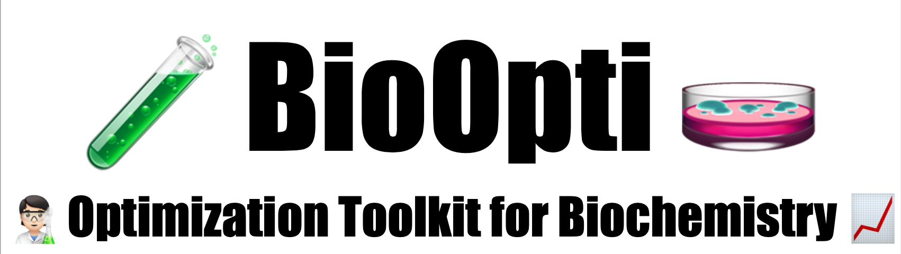

  


**BioOpti** was created to help optimizing biochemical workflows, from culture media formulation to enzymatic reaction simulations. Designed for researchers, students, and bioprocess enthusiasts, BioOpti makes it simple to model, predict, and refine experimental setups.

---

# 📚 Table of Contents

- [Features](#features)
- [Installation](#installation)
- [Development Setup](#development-setup)
- [Running Tests](#running-tests)
- [Quick Start](#quick-start)
- [Contributors](#contributors)
- [License](#license)

---

## Features

- 📈 **Culture Media Optimization**:  
  Query the BACDive database to retrieve documented culture media for a given bacterial strain (by taxon name or culture collection number).
  Display each medium’s name, composition, reported growth performance, and associated metadata such as optimal temperature.

- 🔬 **Enzymatic Reaction Simulation**:  
  Predict enzyme-catalyzed reaction rates under varying conditions (substrate concentration, pH, temperature, inhibitors).
  Easily simulate and optimize reactions based on Vmax, Km, inhibition type, and environmental factors.

---

## Installation

### 🔄 Clone the Repository

First, choose a location on your computer where you want to store the project. For example, you can use your `Documents` folder.
Open your terminal and run:

```bash
cd ~/Documents  # or any folder where you want to store the project
git clone https://github.com/Clarabrgnz/BioOpti.git
cd BioOpti
```

This will create a folder named `BioOpti` containing all the project files.

---

### 🐍 Create and Activate a Python Environment

Then, create a new environment (feel free to use a different environment name if you prefer):

```bash
conda create -n bioopti python=3.10
conda activate bioopti
```
---

### 📥 Install the Package

Make sure you are inside the `BioOpti` folder and run:

```bash
pip install .
```
---

### 📓 Install JupyterLab

In order to use the Jupyter Notebook for demos or development:

```bash
pip install jupyterlab
```
---

## Development Setup

If you're developing BioOpti or contributing to it, install in Editable Mode with Extra Dependencies

```bash
pip install -e ".[test,doc]"
```
---

## Running Tests

To run the test suite and check coverage:

```bash
pip install tox
tox
```
---

## Quick Start

### ➞ Culture Media Optimization
This example shows how to query the BACDive database for a known strain, and retrieve the list of documented culture media with associated growth performance.

```python
from bioopti.media_optimizer import run

# Query BACDive for a bacterial strain
run("Pseudomonas aeruginosa")
```

### ➞ Simulating Enzymatic Reactions
This example shows how to simulate the rate of an enzyme-catalyzed reaction using known kinetic parameters.
Provide experimental conditions such as substrate concentration, Vmax, Km, pH, temperature, and optional inhibitor information, and the function simulate_reaction_rate will calculate the expected reaction rate (µmol/min) under these specific conditions.

```python
from bioopti.reaction_simulator import simulate_reaction_rate

# Simulate an enzyme-catalyzed reaction
rate = simulate_reaction_rate(
    substrate_conc=2.5,    # [S] in mM
    vmax=1.8,              # Vmax in µmol/min
    km=0.5,                # Km in mM
    pH=6.8,                # current pH
    temp=35.0,             # current temperature °C
    optimal_pH=7.0,        # enzyme's optimal pH
    optimal_temp=37.0,     # enzyme's optimal temperature
    pH_sigma=1.0,          # pH tolerance
    temp_sigma=5.0,        # temperature tolerance
    inhibitor_conc=0.1,    # inhibitor concentration [I] in mM
    ki=0.05                # inhibition constant Ki in mM
)

print(f"Simulated reaction rate: {rate:.2f} µmol/min")
```
---

## Contributors

- **Clara Bergonzi** — Package Infrastructure, Reaction Simulation Module
- **Pietre Bonaldi** — Media Optimization Module and test simulation for its optimization.
- **Marc Tang Vidale** — Media Optimization Module, Notebook Development Contribution
- **William Brian Pellassy** — Reaction Simulation Module, Notebook Development Contribution
---

## License

This project is licensed under the **MIT License**.  
You are free to use, modify, and distribute this software with appropriate attribution.  
See the [LICENSE](LICENSE) file for full details.

---

🚀 Happy optimizing with BioOpti 🚀
